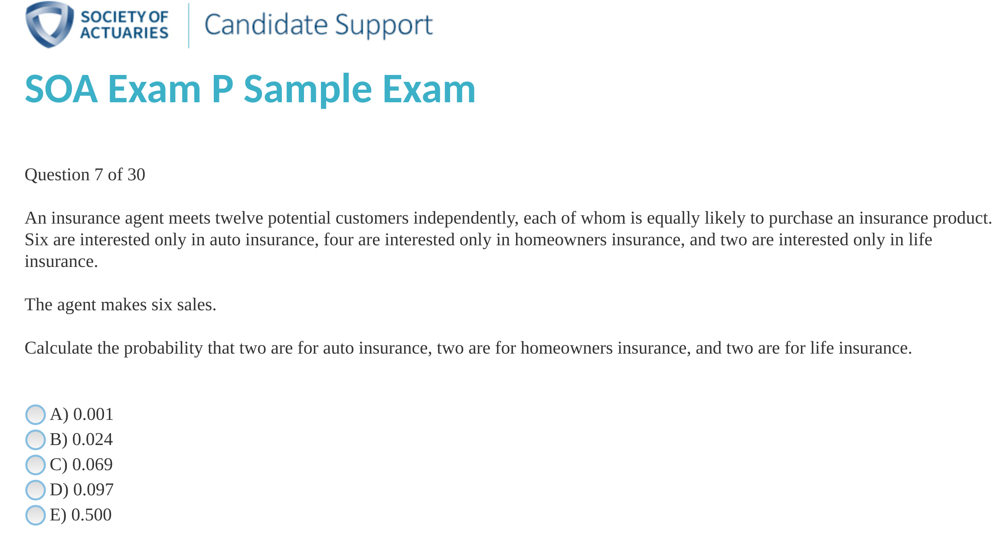

```{r setup, include=FALSE}
knitr::opts_chunk$set(echo = FALSE)
knitr::opts_chunk$set(warning = FALSE, message = FALSE) 
```

Name: _________________________________________________

## Instructions

Please read the following before starting the exam:

1. The exam is worth 200 points and consists of 6 multiple choice questions and 2 free response questions. Point values are included next to questions - please allocate your time appropriately
2. There is a blank page on the back of the last sheet that you may use if you run out of room writing any questions - just label appropriately so that I can follow your work
3. You must show all your work to receive partial credit for incorrect answers.
4. You may not communicate with classmates or other people about the exam.
5. Laptops, phones, and other electronics devices are not allowed during the exam. You may use a calculator.
6. Numeric answers may either be written as a decimal or as a reduced fraction
7. The exam is due at the end of class. No exams will be accepted after this time.

\newpage

## Question 1 (5 points)

Which of the following distributions has the largest mean? (note that the axes are all identical)

```{r,out.width="75%"}
library(gridExtra)
library(data.table)
library(ggplot2)
x <- seq(from=-5,to=5,length.out=100)
y <- dnorm(x,-2,1)
dt <- data.table(x=x,p=y)
plot1 <- ggplot(data=dt,aes(x=x,y=p)) + geom_line() + theme_bw() + scale_x_continuous(limits=c(-5,5)) + scale_y_continuous(limits=c(0,1.2)) +ggtitle("A")
y <- dnorm(x,2,1)
dt <- data.table(x=x,p=y)
plot2 <- ggplot(data=dt,aes(x=x,y=p)) + geom_line() + theme_bw()+ scale_x_continuous(limits=c(-5,5))+ scale_y_continuous(limits=c(0,1.2)) +ggtitle("B")
y <- dnorm(x,0,3)
dt <- data.table(x=x,p=y)
plot3 <- ggplot(data=dt,aes(x=x,y=p)) + geom_line() + theme_bw()+ scale_x_continuous(limits=c(-5,5))+ scale_y_continuous(limits=c(0,1.2)) +ggtitle("C")
y <- dnorm(x,0,0.33)
dt <- data.table(x=x,p=y)
plot4 <- ggplot(data=dt,aes(x=x,y=p)) + geom_line() + theme_bw()+ scale_x_continuous(limits=c(-5,5))+ scale_y_continuous(limits=c(0,1.2)) +ggtitle("D")
grid.arrange(plot1, plot2,plot3,plot4,ncol=2)
```

## Question 2 (5 points)

Which plot exhibits the most negative correlation?

```{r,out.width="75%"}
set.seed(4)
f <- function(p) {
  dt <- as.data.table(MASS::mvrnorm(n=100,c(0,0),matrix(c(1,p,p,1),2,2),empirical=TRUE))
  names(dt) <- c("x","y")
  dt
}
plot1 <- ggplot(data=f(0),aes(x=x,y=y)) + geom_point() + theme_bw() + scale_x_continuous(limits=c(-2,2)) + ggtitle("A")
plot2 <- ggplot(data=f(-.50),aes(x=x,y=y)) + geom_point() + theme_bw() + scale_x_continuous(limits=c(-2,2)) + ggtitle("B")
plot3 <- ggplot(data=f(.75),aes(x=x,y=y)) + geom_point() + theme_bw() + scale_x_continuous(limits=c(-2,2)) + ggtitle("C")
plot4 <- ggplot(data=f(.4),aes(x=x,y=y)) + geom_point() + theme_bw() + scale_x_continuous(limits=c(-2,2)) + ggtitle("D")
grid.arrange(plot1, plot2,plot3,plot4,ncol=2)
```

\newpage

## Question 3 (5 points)

Which of the following would best be categorized as a nominal variable?

* A State (1 = Alabama, 2=Alaska, ..., 51=Wyoming)
* B Age of a person in years
* C Education level (1= high school dropout, 2 = high school graduate, 3 = college graduate, ...)
* D Price (in dollars)
* E All of the above

## Question 4 (5 points)

What is true of the distribution represented by the following histogram?

```{r,out.width="75%"}
set.seed(1)
x <- c(rbeta(1000,shape1 = 1,shape2=3),rnorm(100, mean=2,sd=0.1))
hist(x)
```

* A The distribution is symmetric and unimodal
* B The distribution is left-skewed and unimodal
* C The distribution is right-skewed and unimodal
* D The distribution is left-skewed and bimodal
* E The distribution is right-skewed and bimodal

## Question 5 (5 points)

An outlier is added to a dataset. Which of the following statements is true

* A The mean and median will be equally affected
* B The variance and the interquartile range wil be equally affected
* C The interquartile range will be more affected than the variance
* D the mean will be more affected than the median

## Question 6 (5 points)

$r^2$ is

* A Always between 0 and 1
* B Interpreted as the percentage of variation in y that is explained by x
* C A measure of linear model fit
* D All of the above

## Question 7 (5 points)

What information is not available in the following boxplot

```{r}
set.seed(1)
library(data.table)
x <- rnorm(1000,mean=9,sd=2)
y <- rnorm(1000,mean=10,sd=3)
dt <- data.table(v=c(x,y),d=as.factor(c(rep(1,1000),rep(2,1000))))
ggplot(data=dt,aes(y=v,group=d,lty=d)) + geom_boxplot() + theme_bw()
```

* A The relative means of the distributions
* B The skewness of the distributions
* C The correlation between the distributions
* D All of the above

\newpage

## Question 8 (5 points)

You have events X and Y such that $P(X\cap Y)=P(X)*P(Y)$. What can be inferred about X and Y?

* A X and Y are independent events
* B X and Y are mutually exclusive events
* C X and Y are positively correlated events
* D Nothing - this relationship is always true

## Free Response

## Question 9

You are given the following data: 7,3,1,5,4. Calculate the following:

### a

Median

\
\
\


### b

(population) standard deviation

\
\
\

### c

Interquartile range

\
\
\

## Question 10

What is the median of the following distribution?

```{r}
x <- rnorm(100,mean=5,sd=1)
hist(x,n=5,ylim=c(0,50))
```

\
\
\

## Question 11

How many unique two card hands are there when drawn from a standard deck of 52 cards?

\
\
\


## Question 12

You toss a coin 10 times. What is the probability you obtain exactly 5 heads?

\
\
\


## Question 13

For the following, $P(A) = 0.7, P(B)=0.2, P(A\cap B)=0.1$

### a

Calculate $P(A\cup B)$

\
\
\


### b

Calculate $P(A|B)$

\
\
\

### c

Calculate $P(A')$ where $A'$ represents the complement of A

\
\
\


## Question 14

Given the table below, compute the following:

```{r}
tbl <- matrix(c(25,15,40,20,40,60,45,55,100),c(3,4))
rownames(tbl) <- c("Econ","Other","Total")
colnames(tbl) <- c("Dog","Cat","Total")
tbl
```

### a

$P(Econ\cap Dog)$

\
\
\

### b

$P(Dog|Econ)$

\
\
\

### c

$P(Econ\cup Dog)$

\
\
\

## Question 15

You have three bags of marbles. Bag 1 has 70 red and 30 blue marbles. Bag 2 has 40 red and 60 blue marbles. bag 3 has 90 red and 10 blue marbles. You choose a bag at random, then select a marble within that bag.

### a

What is the probability that it's a red marble?

\
\
\


### b

What is the probability that the marble came from bag 1, given that it's a red marble?

\
\
\


## Extra Credit

You are given the following probabilities:

$P(A)=0.6$
$P(B)=0.5$
$P(C)=0.3$
$P(A\cap B)=0.3$
$P(A\cap C)=0.1$
$P(B\cap C)=0.1$
$P(A\cap B\cap C)=0.05$


Find $P(A|(B\cap C))$ (hint: draw a venn diagram) (5 points)

\
\
\
\
\
\
\

The following is an SOA Exam P question:


\
\

A derangement is a permutation such that none of the elements are in their original order. How many derangements are there of 5 items? [hint: use recursion]


