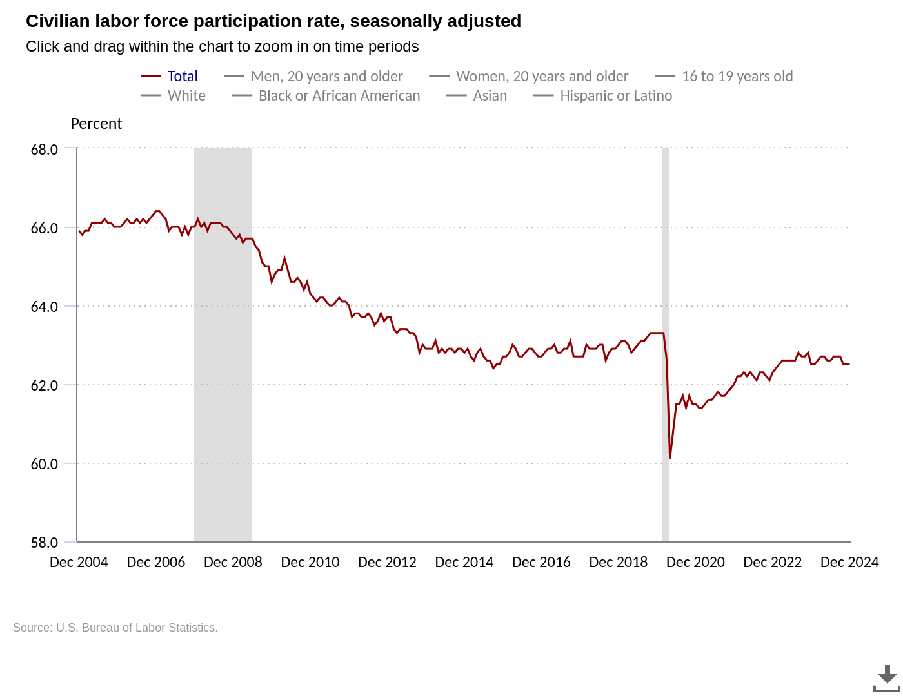
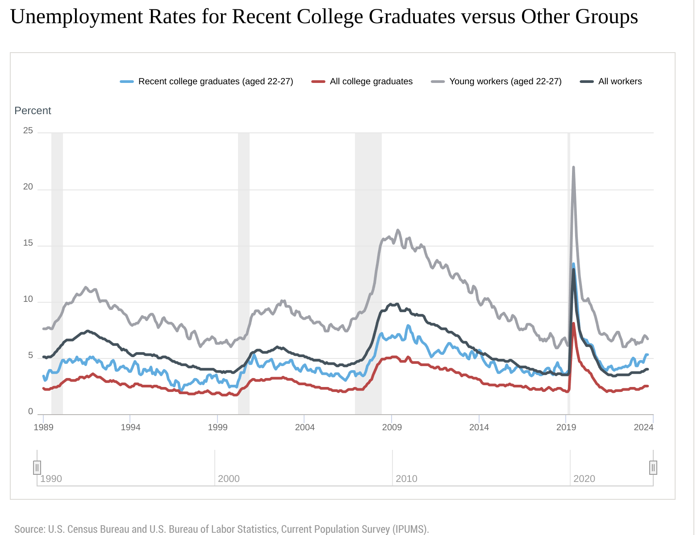

```{r setup, include=FALSE}
knitr::opts_chunk$set(echo = FALSE)
knitr::opts_chunk$set(warning = FALSE, message = FALSE) 
```

# iClicker Test Pop Quiz

Immediately after a basketball leaves a player's hand after taking a 3 point shot, the force on the ball is

* A Upwards and constant
* B Upwards and decreasing
* C Downwards and constant
* D Downwards and decreasing
* E Tangent to the path of the ball

# Why this course is useful

* Data is being used in increasing rates in every job field
* Routine tasks are being automated by AI or offshored
* Employers are reluctant to hire gen Z workers
    * High bar for interviews at good companies
    * Most interviews have an analytic component!
    
# Labor Force Participation Rate



# New College Graduate Success

* over half of hiring managers believe new college graduates are unprepared for the workforce (intelligent.com survey)
* New graduates are being fired at higher rates than in the past
* At least partly due to dilution of the education system, including college

# Unemployment rates



# Bunny Intermission


# How to Get Ahead

* Need to signal quality to interviewers to get interviews
* Improve technical skills to pass interviews
* Developing statistical knowledge and working on projects is the best way
* College is still a good return on investment

# An example of statistical analysis

* Should I make attendance mandatory?
* How would I go about answering this question?

# Data Simulated From Class Data

```{r,echo=FALSE,eval=TRUE}
library(data.table)
library(ggplot2)
dt1 <- fread("../data/fasim24.csv")
dt2 <- fread("../data/spsim24.csv")
dt <- rbind(dt1,dt2)
dt[,exam:=exam*100]

ggplot(data=dt1,aes(x=attendance,y=exam)) + geom_point() + geom_smooth(method='lm',se=F) + theme_bw()
```

# Is This Strong Evidence?


# Attendance Fluctuations

```{r}
#1 -> .17 => .68sd -> 8 points
#Effect implies fully attending class improves scores by 0.4 student standard deviations
#This is about half a letter grade
dtx <- fread("../data/attendancesim.csv")
ggplot(data=dtx[i%in%(1:3)],aes(x=azd,y=ezd2)) + geom_point() + geom_smooth(method="lm",se=F) + theme_bw() +
  xlab("Attendance Differential From Individual Mean") +
  ylab("Exam Differential From Individual Mean")
```

# Heterogeneity

```{r,dpi=720,out.height="50%", out.width="100%"}
#Above median students benefit less - substitution
#.12 for good, .23 for 'bad'
#twice as effective for bad students
dtx[,g:=as.factor(g)]
dtx[,`Above Median Student`:=g]
ggplot(data=dtx[i%in%1:3],aes(x=azd,y=ezd,group=`Above Median Student`,color=`Above Median Student`)) + geom_point() + 
  geom_smooth(method='lm',se=F) + theme_bw() + scale_color_manual(values=c("1"="red","0"="blue")) +
  xlab("Attendance Differential From Individual Mean") +
  ylab("Exam Differential From Individual Mean")
```

# Consistency?

```{r}
ggplot(data=dtx[i%in%(4:6)],aes(x=azd,y=ezd2)) + geom_point() + geom_smooth(method="lm",se=F) + theme_bw()+
  xlab("Attendance Differential From Individual Mean") +
  ylab("Exam Differential From Individual Mean")
```

# Score Persistence

```{r}
#ggplot(data=dtx[i%in%1:3,.(f,i,e)],aes(x=i,y=e,group=f)) + geom_point() + geom_line() + theme_bw()
#hist(dtx[i%in%1:3,12*(min(ez2)-mean(ez2)),by=f]$V1)
dtxx <- dtx[i%in%1:3][,.(f,i,ez2,az)][f!="Sam"&f!="Maximiliano"]
ggplot(data=cbind(dtxx[i==1,.(exam1=ez2)],dtxx[i==2,.(exam2=ez2)]),aes(x=exam1,y=exam2)) + geom_point() + geom_smooth(method="lm",se=F) + theme_bw()
```

# Attendance Persistence

```{r}
#ggplot(data=dtx[i%in%1:3,.(f,i,e)],aes(x=i,y=e,group=f)) + geom_point() + geom_line() + theme_bw()
#hist(dtx[i%in%1:3,.25*(min(az)-mean(az)),by=f]$V1)
ggplot(data=cbind(dtxx[i==1,.(attendance1=az)],dtxx[i==2,.(attendance2=az)]),aes(x=attendance1,y=attendance2)) + geom_point() + geom_smooth(method="lm",se=F) + theme_bw()
```

# My Takeaways

* Exams are consistent for most students
    * But that I should still offer some 'cushion points' 
* Attendance probably improves performance
    * Effect is probably "small"
    * "Attendance" is only a proxy for effort. May break down!
    
# Applications

* You should apply similar thinking to your job
    * Everyone will use metrics. But the metrics will be misinterpreted
    * Sales are down. Why, and what should we do about it?
* Our goal is to get an understanding of the statistical properties of data
    * So that we don't make decisions based on random chance

# Tying it Together

* Bad employment outcomes, poor student practices, and poor data analytics are related
* By putting effort into learning quantitative skills you'll be in a better position when you graduate
