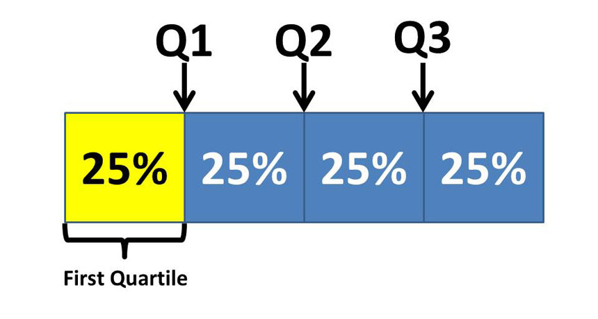
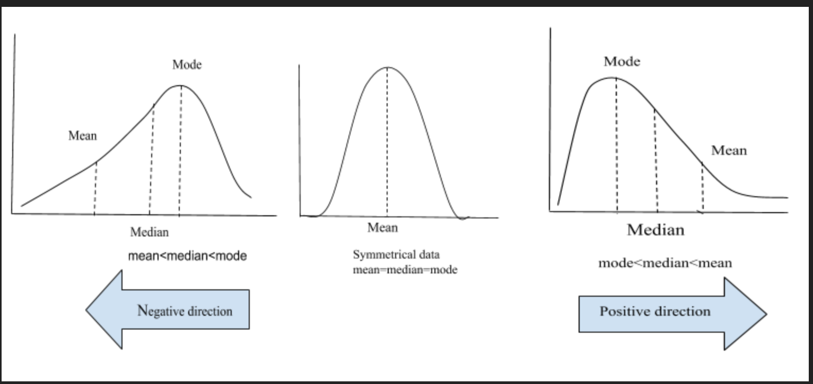

```{r setup, include=FALSE}
knitr::opts_chunk$set(echo = FALSE)
knitr::opts_chunk$set(warning = FALSE, message = FALSE) 
```

# Types of Data (1.2.2)

* Quantitative
    * Interval: differences are meaningful
    * Ratio: nonnegative with a "true zero"
    * Discrete or Continuous
        * Discrete use counting numbers
* Qualitative (categorical)
    * Ordinal: order matters
    * Nominal: No order
    
# Quantitative Examples

* Money (ratio)
* Weight (ratio)
* Time (interval)
* Temperature (F or C) (interval)
    * Kelvin is ratio
    
# Quantitative Data

* I don't care about the distinction between ratio and interval
* Important thing is that we can interpret values in context
    * When comparing income levels of earners, should we compare differences or ratios?
* Data classifications aren't necessarily standardized

# Qualitative Examples

* Name (nominal)
* State (nominal)
* Educational Attainment (ordinal)
* Student Evaluation (ordinal)
    * Labeled 1-5, but not a true quantitative variable
    
# Examples

```{r comment=NA}
library(data.table)
set.seed(1)
data.table(`Student ID`=1:5,`SAT Score` = round(rnorm(5,1600,100),0),age=c(18,19),Grade=c('A','B','C'))
```

A Quantitative
B Ordinal
C Nominal

# Summarizing Data

* Some data analysis techniques only work for numeric data
* We'll start with some more holistic measures, then move to single-number summary statistics

# Quantiles and Box Plots (2.1.5)

* Suppose you have data that consistent of students exam scores
* You're interested in understanding the general distribution of these scores

```{r comment=NA,echo=FALSE}
exams <- c(83L, 74L, 87L, 58L, 71L, 59L, 83L, 90L, 80L, 75L, 77L, 87L, 
92L, 66L, 63L, 76L, 93L, 98L, 79L, 72L, 85L, 59L, 85L, 83L, 79L, 
77L, 78L, 65L, 63L, 80L, 80L, 78L, 77L, 67L, 78L, 90L, 50L, 79L, 
99L, 94L, 87L, 67L, 83L, 89L, 82L, 61L, 75L, 61L, 45L, 52L, 90L, 
96L, 75L, 72L, 73L, 82L)
cat(exams)
```

# Order Statistics

* One easy thing we can do is sort the data
* What are the largest and smallest values?

```{r comment=NA,echo=FALSE}
cat(sort(exams))
```

# Quantiles and Box Plots (2.1.5)

* We define the median as the 'middle' value: half of all exam scores are below this, and half are above
    * If there's an even number a common convention is to take the average
* What is the median of the following data?

```{r comment=NA}
cat(c(13,2,10,8,5))
```

# Quantiles and Box Plots (2.1.5)

* Median for the exams?

```{r comment=NA,echo=FALSE}
cat(sort(exams))
```

# Quantiles and Box Plots (2.1.5)

* The median is a measure of central tendency
* Often we're interested in more than just the average student
* One more general way is to divide the class into 4 groups instead of 2
    

    
# Quantiles and Box Plots (2.1.5)

What is the third quartile (Q3) of exam scores?

```{r comment=NA,echo=FALSE}
cat(sort(exams))
```

# General quantiles

* In general we define as percentile as the number such that p\% of the data lies below this point
* The probability notation for this is rather confusing: $x: P(X\le x)\ge p$
* The 1st, 2nd, and 3rd quartiles are the 25th, 50th, and 75th percentiles
    * The 2nd quartile is also the median
    * The top 1\% is the 99th percentile
    
# Interquartile Range and Outliers

* The difference between the first and third quartiles is called the interquartile range (IQR)
    * IQR = Q3-Q1
    * It gives a measure of spread, or dispersion, of the distribution
* An outlier is an extreme observation that is atypical
    * No consistent definition, but sometimes defined to be more than 1.5 times the IQR from the median

# Box Plots

* Using the quartiles and the IQR we can give a plot that is a good summary of our data
* The Q1, the median, and Q3 are all plotted as a line, creating a box
* Whiskers extend from the top and bottom of the box until it either reaches the max/min of the data, or until it reaches 1.5 times the IQR, whichever comes first
* Any values outside this range (the outliers) are individually plotted

# Box Plots

```{r comment=NA,echo=FALSE}
library(ggplot2)
library(scales)
ggplot(data=data.table(exams),aes(y=exams)) + geom_boxplot() + theme_bw() + scale_y_continuous(breaks=pretty_breaks(10),minor_breaks=pretty_breaks(20))
```

# Histogram (2.1.3)

* Boxplots provide a good summary, but leave out information
* We can instead bin our exams into ranges and count how many students fall in each
    * e.g. 18 students scored in the 70s, and 15 in the 80s
* If the bins are of equal size this plot is called a histogram

# Histogram

* This is a 'left-skewed' exam

```{r comment=NA,echo=FALSE}
hist(exams)
```

# Skewness

* If the tail tapers off to the right, a distribution is skewed right
    * Generally means that the mean (average) is greater than than the median
* A distribution with no skew is symmetric



# Absolute vs Relative

* We can plot histograms with either the counts or the percentages. Percentages tend to be more useful when comparing distributions
* This plot uses 'density' - multiply by the bin width to get the percentage

```{r comment=NA,echo=FALSE}
hist(exams, probability=TRUE)
```

# Kernel Density

* An alternate way to draw this is with a kernel density plot
* Good for overlaying distributions

```{r comment=NA,echo=FALSE}
ggplot(data=data.table(exams),aes(x=exams)) + geom_density() + theme_bw()
```

# Bin width

* More bins will reveal more details, but be less smooth
* Optimal bin width is more of an art than a science

```{r comment=NA,echo=FALSE}
hist(exams, n=10)
```

# Bimodality

* The mode is the most frequent observation in data
* If the histogram has two peaks, it is called bimodal
* The exams are bimodal - there is a peak round 65 and around 75 in the data

# View Tradeoffs

* Note that in the first histogram the skewness is easier to see, while in the second the bimodality is easier to see
* We often want multiple views of data to get a sense of the distribution

# Qualitative Data

* We can still construct something akin to a histogram for ordinal data
* For nominal data, we can construct a regular bar graph to display count information

# Summary statistics (2.1.2)

* We often want to view the whole distribution, but sometimes we just need a simple summary
* Summary statistics can give a brief overview of the data as a single number
* The quartiles and median are all examples of such summary statistics

# Central Tendency

* The center of a distribution is usually important - it represents the 'average' data point
* The median is one measure of central tendency
* The more common one is the mean (or average)

# Mean

* The mean, $\bar x$, is just the average of a set of data
* $\bar x = \frac{x_1+x_2+...+x_n}{n}=\frac{1}{n}\sum_{i=1}^n x_i$
    * We will see some alternative notation when discussing probability distributions
* This is the 'balancing point' of a distribution - equal weight is on both sides
    
# Mean vs Median

* Consider the following set of numbers. What is the mean?
* {1,1,1,2,2,2,3,3,3,22}

# Robustness

* For the prior sample, removing 22 yields a mean of 2.
* By comparison, the median would be 2 in both cases
* The median is said to be robust: outliers in the data do not have a large effect
* The mean is not robust

# Why the mean

* If the median is more typical of the average, why use the mean at all?
* Consider calculating average insurance claims: the mean is what affects the profitability of the insurance company, not the median!
* Usually we (should) care about both

# Weighted Means

* Sometimes observations are weighted. In this case we can just multiply by the weight before averaging
* Consider if our observations were aggregated beforehand. What is the average exam score?

```{r}
dtt <- data.table(exams)[,.N,keyby=round(exams,-1)][round<70]
names(dtt)[1] <- "Score"
dtt
```

# Weighted Mean Calculation

* We can 'expand' the data and calculate the mean: {40,50,50,60,60,60,60,60,60,60,60}
* Or we can directly weight it: 40/11 + 50\*2/11 + 60\*8/11
* Both answers are identical

# Dispersion (spread)

* In addition to the center of the distribution, we usually care about the dispersion, or spread
* The interquartile range is one example of dispersion
    * Like the median, it is robust to outliers

# Variance (2.1.4)

* The more common way of measuring spread is with the variance
* The average squared distance of each point to the center
    * $var(x)=\frac{(x_1-\bar x)^2 + (x_2-\bar x)^2 + ... + (x_n-\bar x)^2}{n}=\frac{1}{n}\sum_{i=1}^n(x_i-\bar x)^2$
* Why squared distance?

# Practice

* What is the variance of the set {1,2,3,4,5}?

# Standard Deviation

* Squared units are hard to interpret. We usually take the square root of the variance for this reason
* This is called the standard deviation, usually labeled as $\sigma$ (sigma)
    * $\sigma=\sqrt{var(x)}$
    * $var(x)$ is sometimes labeled $\sigma^2$
    
# A note on sample vs population

* We're holding off on discussing populations vs samples, but the formulas for variance and standard deviation will be different
    * We'll prove this when we get to discussing sampling
    
# Interpreting Standard Deviation

* Standard deviation is 'almost' the average distance from the mean of the distribution
* Chebyshev's inequality tells us a bit more: $1-\frac{1}{k^2}$ of the data is within k standard deviations of the mean
* This means that 75\% of the data is always within 2 standard deviations of the mean
* About 95\% of the data is within 4.5 standard deviations of the mean

# Interpreting Standard Deviation

* For a special distribution called a normal distribution, 68\% of the data falls within 1 standard deviation of the mean
* 95\% falls within 2 standard deviation, and 99.7\% within 3 standard deviations

```{r}
x <- seq(from=-4,to=4,by=.01)
y <- 1/sqrt(2*pi)*exp(-x^2/2)
dtnorm <- data.table(x,y)
ggplot(data=dtnorm,aes(x=x,y=y)) + geom_line() + theme_bw() + 
  geom_ribbon(data=dtnorm[(x>=-3&x<=-2)|(x>=2 & x<=3) ], aes(ymax=y),ymin=0,fill='purple') +
  geom_ribbon(data=dtnorm[(x>=-2&x<=-1)|(x>=1 & x<=2) ], aes(ymax=y),ymin=0,fill='blue') +
  geom_ribbon(data=dtnorm[(x>=-1&x<=-0)|(x>=0 & x<=1) ], aes(ymax=y),ymin=0,fill='red')
```

# Z-scores

* It is common to 'normalize' data by subtracting the mean and dividing by the standard deviation
* Gives a new distribution with mean 0 and standard deviation 1
* The resulting value is the z-score. It's the number of standard deviations above or below the mean
* Example: Exams had a mean of 76 and standard deviation of 12. A score of 82 would have a z-score of 0.5


# Absolute Deviance

* Why not just use the average of the absolute distance from the mean, instead of squared distance?
    * Historically easier to calculate (absolute value is not differentiable)
    * Has synergy with the normal distribution
    * Absolute moments are seeing more usage in modern machine learning
        * Still a tradeoff. General $L^p$ spaces in topology are informative

# Other moments

* We can also use summary statistics to categorize the skewness and tail weight
    * Skewness relies on cubed deviations from the mean
    * Tail weight (kurtosis) uses deviations to the fourth power
* Deviations raised to an integer power like this are called central moments. We won't use them much in this class, but are sometimes useful
    * They're frequently used in formal proofs of statistical properties
