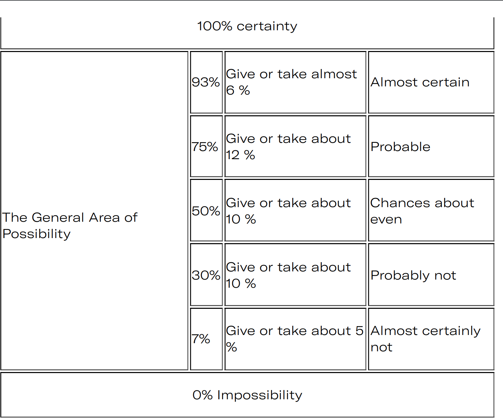
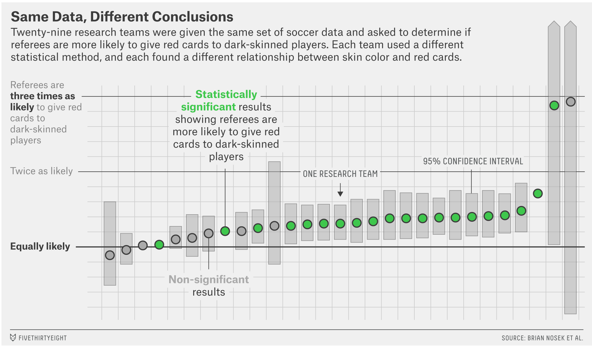

```{r setup, include=FALSE}
knitr::opts_chunk$set(echo = FALSE)
knitr::opts_chunk$set(warning = FALSE, message = FALSE) 
knitr::opts_chunk$set(comment = "")
```

## Descriptive vs Inferential Statistics

* What we've done so far is describe data using basic statistics
* Ideally, we want to make inferences using data
* We'll need some basic probability theory to do this

## Introduction to Probability

* Probability is a mathematical framework for describing random events
* How do we define random?

## Random Examples

* A flip of a coin
* Radioactive decay
* A critical hit in Pokemon
* The temperature tomorrow
* Your height

## The role of information

* Random is not necessarily the opposite of deterministic
* The key element of random events is information
* A coin flip is random when we don't know the inputs

## Subjective Probabilities

* Different individuals may assess a random event differently
    * The probability that you're 6 feet tall is very different from my perspective than from yours
* But this doesn't mean that probability is a subjective opinion
    * Most assessments of probability are terrible!

## CIA Guidelines for probability



## Red Card



## Coin Shennanigans

* You Can Load a Die, but You Can't Bias a Coin (Gelman and Nolan, 2002)
* Dynamical Bias in the Coin Toss (Diaconis, Holmes, and Montgomery, 2007)
* Fair coins tend to land on the same side they started: Evidence from 350,757 flips (Bartos et al 2023)


## Probability: Process To Data

* In probability, we make assumptions about the data generating process
    * coin flips are independent with probability 0.5
    * students enter a classroom at a Poisson rate of 2 per minute
* Given these, we can calculate the likelihood that different patterns of data will appear
    * 500 heads in 1000 coin flips?
* Probability is pure math - the question is whether our assumptions match reality

## Statistics: Data To Process

* In statistics, we assume some incomplete knowledge of the world
    * Coin flips are independent, but that the probability of heads is unknown
* Given the data, we then make inferences about what the 'true' proportion of heads is
* There's never a 'correct' answer in statistics.
    * Some approaches are more reasonable than others