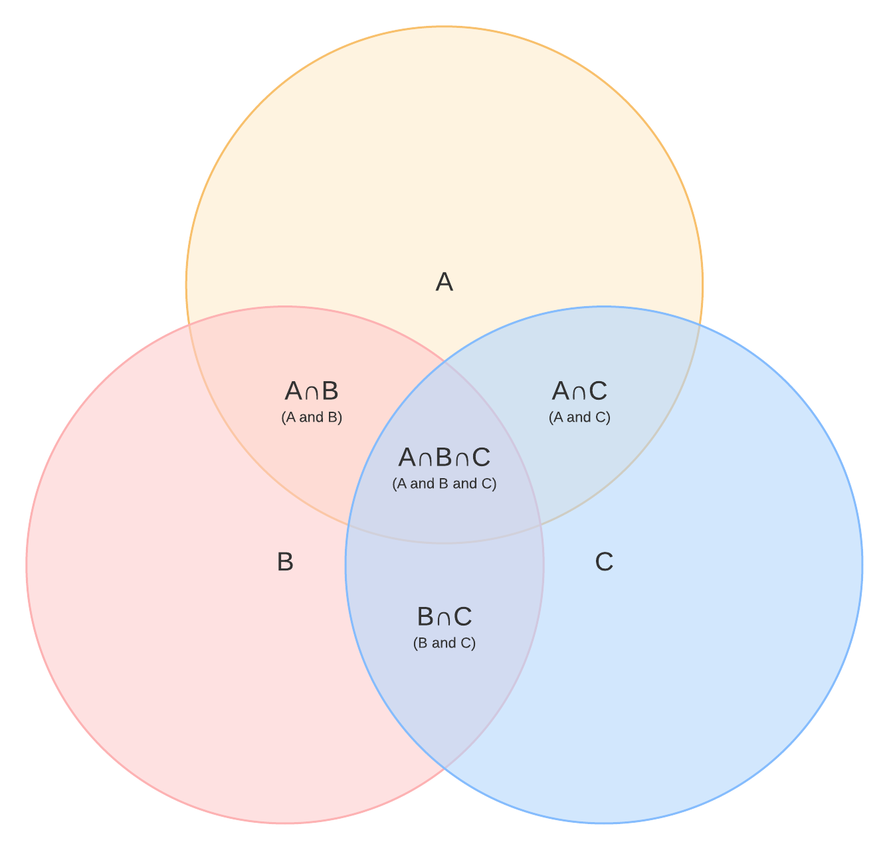
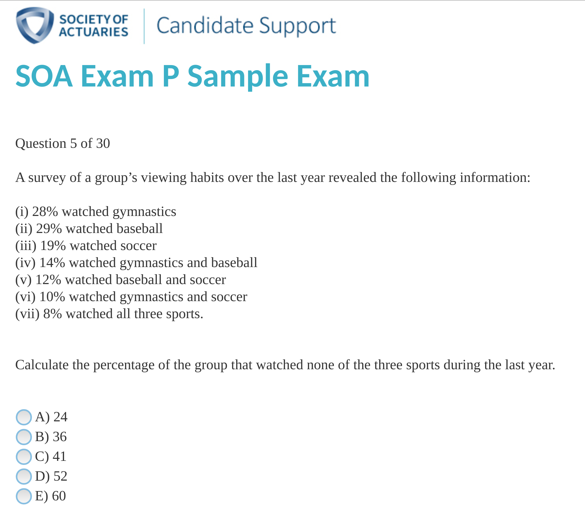

```{r setup, include=FALSE}
knitr::opts_chunk$set(echo = FALSE)
knitr::opts_chunk$set(warning = FALSE, message = FALSE) 
knitr::opts_chunk$set(comment = "")
```

## Intro to Probability

* Consider a fair coin
* Two options: $\{H,T\}$
* Frequentist view: if all options are equally likely, just need to count
* We'll start with counting, then work on expanding to general probability

## Basics of Counting: Sets

* Suppose we flip a coin twice. How many ways are there to obtain 1 head?

## Counting sets

* We can enumerate all possible outcomes: $\{HH,HT,TH,TT\}$. Each is equally likely
* 2 options with 1 head with 4 possible options
* Note that the order matters here

## General power sets

* Suppose we instead toss 3 coins. How many possible options are there?

## General Power Sets

* When we toss 1 additional coin, we have all of the previous options, plus either a heads or a tail at the end.
* So we end up with twice as many

## General Power Sets

* Number of possible coin tosses for 10 tosses?
* Denominator is easy. But how would we count the number of ways to get 5 heads?

## Simple counting example

* You roll two six sided dice. How many possible outcomes are there (assuming that order matters)?
* What's the probability that the sum of the two dice is a 4?

## Permutations

* First consider the number of ways to order distinct items
* How could we arrange the letters A,B,C?
    * How does this differ from the number of ways to toss 3 coins?
    
## Permutations: factorial

* To find the number of ways you can arrange n distinct items using every item exactly once, use recursion
* n choices for first placement, n-1 for second, n-2 for third , ...
* $n(n-1)(n-2)...1\equiv n!$
    * read "n factorial"
* Number of ways to arrange 4 distinct items?
    
## Permutation: general

* Suppose we have 4 distinct items, but we only want to arrange 2 of them. How many ways are there to do this?
* Sometimes labeled as $_4P_2$
* Formula?

## Permutations with Repetition

* We're now almost able to deal with counting coins. We just need a way to deal with repetition
* Consider the problem of how many ways we can arrange the letters A, B, A. We use each letter once
* If the As were different (e.g. one capital one lowercase), we would just have 3!

## Permutations with Repetition

* Now consider the letters S, T, A, T, S
* There are 5! permutations if S and T are differentiated. How much double counting is there?
* General formula?

## Permutations with Repetition

* Suppose we have k items, each appearing $k_i$ (possibly 1) times, with $\sum k_i=n$
* Total permutations: $\frac{n!}{\Pi_{i=1}^k n_i!}$
    * $\Pi$ is product
* Total permutations of the letters in banana?

## Combinations

* Now we can get to counting heads. This is a special case of the prior formula
* Suppose you have 5 coin flips and want to how many ways to produce 3 heads
      * i.e. permutations of HHHTT?

## Combinations

* When we only have 2 classes (a binary variable) this formula simplifies
* If we have n coin tosses, and k are heads, then there must be (n-k) tails
    * $=\frac{n!}{k!(n-k)!}$
* Usually denoted as $n \choose k$ and read "n choose k"

## Coin Tossing

* You toss a coin 6 times. What is the probability you obtain 3 heads?

## Poker

* Combinations generally work in cases where order doesn't matter
* How many possible 5 card hands are there in poker?

## Birthday 'Paradox'

* Suppose there are 23 students in a room. What is the probability that two people share a birthday?

## Probability Axioms

* With counting problems, we can calculate probabilities as long as every outcome is equally likely
* In general, we need a way to deal with outcomes that are not identical
* We start with some axioms of probability, then draw parallels where we can with the basic counting approach

## Probability Axioms

* We start with a set of all possible outcomes, called a **sample space**
    * For tossing two coins, the sample space is $S=\{HH,HT,TH,TT\}$
* An **event** is a subset of the sample space
    * The event that you obtain 1 head is $\{HT,TH\}$
* We define a function P that measures the probability of any event. We require $P(S)=1$ and $P(\emptyset)=0$, where $\emptyset$ is the empty set

## Probability Axioms

* In general, we assign a probability to each atom (individual element) of the sample space
    * $P(\{HH\})=P(\{HT\})=P(\{TH\})=P(\{TT\})=\frac{1}{4}$
* We then have a rule for combining elements in an event. If we have two **disjoint** (or **mutually exclusive**) events A and B, then the probability that either A or B occurs is $P(A)+P(B)$
    * "A or B" is sometimes written as $A\cup B$ for set union
    * This is formally called sigma subadditivity 

## Mutual Exclusion

* Two events are mutually exclusive if they don't share any elements. Mathematically: $A\cap B = \emptyset$
    * $A\cap B$ is the intersection of A and B, or more simply "A and B"
* $\{HT,TH\}$, and $\{HH\}$ are mutually exclusive. 
    * Tossing exactly two heads and exactly 1 heads
* $\{HT,TH,HH\}$ and $\{HH\}$ are not mutually exclusive
    * Tossing at least one head and tossing exactly two heads have elements in common: $\{HT,TH,HH\}\cap\{HH\}=\{HH\}$
    
## Example

* What is the probability that a randomly drawn card in a standard deck of 52 is either a club or a heart?
* What about the probability that it's either a club or a king?
    
## General Addition

* If events aren't mutually exclusive, then we can't just add their probabilities
* The intersection of the two events ends up getting double counted in the process
* Easy correction: just subtract out the intersection
    * $P(A\cup B) = P(A) + P(B) - P(A\cap B)$
    
## General Addition

* Suppose that 75\% of students are econ majors, and 50\% of students arrive to class late. 30\% of students are econ students who arrive to class late. What percent of students are either econ students or arrive to class late?

## Complement

* Sometimes, it's easier to indirectly count probability
* What is the probability of obtaining 1 or more heads in 10 coin tosses?
    * $P(H=1)+P(H=2)+...+P(H=10)$
    * OR $1-P(H=0)=1-\frac{1}{1024}=\frac{1023}{1024}$
* Usually labeled as either $P(A')$ or $P(A^c)$

## Basic Examples

* Roll a 6 sided die and let the events $A=\{2,4,6\}, B=\{4,5,6\}$
* What is $A\cup B$? $A\cap B$? $A'?$
* $P(A\cup B)$
* $P(A\cup A')?$


## Venn Diagram


## Venn Diagram


    
## Exam P Question


    
## conditional probability/multiplication rule

* Sometimes we want to know the probability of an event when we're given additional information
* $P(A|B)$ is the probability of A given B
* We're just restricting our sample space to B first
    * $P(A|B) = \frac{P(A\cap B)}{P(B)}$
    * Or $P(A|B)P(B)=P(A\cap B)$
    
## Conditional Probability

* Suppose 60\% of people like peanut butter, 50\% like jelly, and 40% like both. Given that a
randomly sampled person likes peanut butter, what’s the probability that they also likes jelly?

* Given that a randomly sampled person likes jelly, what's the probability they also like peanut butter?
    
## Independence	

* In the previous example, learning that someone likes peanut butter changes the probability that they like jelly. $P(J)=50\%$, but $P(J|P) = 67\%$
    * Become peanut butter and jelly are complements, learning someone likes one means they're more likely to like the other
* Two events are **independent** if $P(A\cap B)=P(A)P(B)$
    * or $P(A|B)=P(A)$ and $P(B|A)=P(B)$
    * No information about A is gained when B is revealed
    
## Independence

* Suppose $P(A)=0.3$ and $P(B)=0.7$. Can you calculate $P(A\cup B)$? $P(A|B)$?
    * What if they're independent?
* Examples of independent events?

## Joint Probability Distributions

* If we can fill in missing information ($P(A\cap B)$ we can specify a probability distribution)
* Equivalent to being able to fill out a full venn diagram
* We can also convert to a table

## Joint Probability Distributions

* Suppose $P(A)=0.4$, $P(B)=0.5$, $P(A\cap B)=0.1$
* $P(A\cup B)$?

```{r}
library(data.table)
library(ggplot2)
tbl <- matrix(c(' ',' ',' ',' ',' ',' ',' ',' ',' '),c(3,3))
rownames(tbl) <- c("A     ","A'    ","Total")
colnames(tbl) <- c("B     ","B'    ","Total")
noquote(tbl)
```

## Marginal Probabilities

* Sometimes we're given a joint distribution of A and B, but only want A
* Let A be the distribution of major, and B of year. What is the distribution of A?
* What percent of students are psych majors?

```{r}

library(data.table)
tbl <- matrix(c(.1,.05,.15,'',.1,.05,.1,'',.05,.05,.1,'',.05,.1,.1,'',' ',' ',' ',1),c(4,5))
rownames(tbl) <- c("Econ","Math","Psych","Total")
colnames(tbl) <- c("Freshman","Sophomore","Junior","Senior","Total")
noquote(tbl)
```

## Marginal probabilities: Formula

* Getting marginals from a table is easy. But if we don't have a table?
* $P(X) = \sum_Y P(X,Y)$
    * We're just summing across a row or column
* $P(X)$ as calculated above always sums to 1 itself, so it is a valid distribution
    * $\sum_X\sum_Y P(X,Y)=1$
* The formulas can look complicated, but they're based on simple principals

## Law of Total Probability

* You have three bags of marbles. Bag 1 has 60 red and 40 blue marbles. Bag 2 has 50 red and 50 blue marbles. bag 3 has 5 red and 15 blue marbles.
* You choose a bag at random, then select a marble within that bag.
* What is the probability that the marble is red


## Law of Total Probability

* Let $B_1, B_2, ... B_n$ be a partition of S. i.e. $B_i\cap B_j=\emptyset\ \forall i,j$ and $\bigcup_k B_k=S$
* $P(A)=P(A|B_1)P(B_1) + P(A|B_2)P(B_2)+...+P(A|B_n)P(B_n)$
* Simple version: $P(A|B)P(B) + P(A|B')P(B')$
* Scary formula, easy intuition!

## Law of Total Probability

* When the weather is good, the probability that you will arrive to class is 90\%. But when the weather is bad, the probability that you arrive to class if only 50\%
* Suppose there is a 25\% chance of bad weather
* What is the probability you arrive to class?

## Bayes Theorem

* You have three bags of marbles. Bag 1 has 60 red and 40 blue marbles. Bag 2 has 50 red and 50 blue marbles. bag 3 has 5 red and 15 blue marbles.
* You choose a bag at random, then select a marble within that bag.
* What is the probability that the marble came from bag 1, given that it's a red marble?

## Bayes Theorem

* $P(A|B)=\frac{P(A\cap B)}{P(B)}=\frac{P(B|A)P(A)}{P(B|A)P(A)+P(B|A')P(A')}$

## Monty Hall Problem

* You choose between 1 of 3 doors, behind which there is a prize. One of these doors has the grand prize. After choosing, the gameshow host will reveal 1 door at random that you did not choose, but he will never reveal the grand prize in the process.
* After he reveals one of the doors, he gives you the option to switch doors. What is the probability that you win the grand prize if you switch doors?

## Random Variables

* We've already learned how to calculate probability and defined events, but sometimes it makes sense to perform operations on an entire distribution
* A **Random Variable** contains all of the information about a probability distribution
    * Mathematically it just maps events to it's sample space
    * For this class, we care more about the operations we can perform on it than it's definition
    
## Random Variables

* Toss a coin 10 times and let the random variable $X$ denote the number of heads that occur
* The shorthand $X=5$ denotes the event that 5 heads occurs. $P(X=5)={10\choose 5}(\frac{1}{2})^{10}$
* We can similarly denote $P(X=0), P(X=10), P(X\ge 3)$, etc
* Generically, we use $P(X=x)$ to denote the probability of obtaining x coin flips
    * $P(X=x)={10 \choose x}(\frac{1}{2})^{10}$
    
## Random Variables: probability mass function

* For a discrete random variable we use the shorthand $p(x)=P(X=x)$ to denote the probability that an event occurs
* When graphed, the pmf is anologous to the empirical histogram

## pmf: 10 coin flips

```{r}
library(scales)
dt <- data.table(x=0:10,y=dbinom(0:10,10,.5))
ggplot(data=dt,aes(x=x)) + geom_errorbar(aes(ymin=0,ymax=y),width=0) + theme_bw() + scale_x_continuous(breaks=pretty_breaks(10))
```

## CDF

* The pmf gives us all of the information we need to calculate probabilities, but what if we need to calculate $P(3 \le X \le 7)$?
    * Need $p(3)+p(4)+p(5)+p(6)+p(7)$
* One convenient tool is the cumulative distribution function (CDF): $F(x)=P(X\le x)$
    * The above is then $F(7)-F(2)$
* How would we get the median?
    
## CDF

```{r}
dt <- data.table(x=0:10,y=pbinom(0:10,10,.5))
ggplot(data=dt,aes(x=x)) + geom_errorbar(aes(ymin=0,ymax=y),width=0) + theme_bw() + scale_x_continuous(breaks=pretty_breaks(10))
```

## Expectation

* We can also calculate an average of a random variable. We call this the expectation and use the operator E
    * $\mu=E[X]$
* The mean is an average weighted by the probability:
    * $E[X]=\sum xp(x)$
* We can similarly calculate $var(X)=E[(X-E[X])^2)$
    * Expectation is a linear operator, so $E[aX + bY] = aE[X] + bE[Y]$
* Also $cov(X,Y)=E[(X-E[X])(Y-E[Y])]$

## Random Variable Operations

* We partly define random variables to introduce the concepts of pmf/CDF and expectation, but mostly we want to do operations on random variables
* Let $X_1$ be the roll of a 6-sided die, and $X_2$ be the roll of a second 6-sided die. What is $X_1+X_2$?
    * $Y=X_1+X_2$ is its own random variable with a pmf, cdf, and expectation
    * Expectation is easy to calculate. Variance is slightly harder. The pmf is much harder.
    
## Random Variable Addition: Expectation

* First, note that $X_1$ and $X_2$ are identical, so e.g. $E[X_1]=E[X_2]$
* We can get $E[X_1] = \sum xp(x) = \frac{1}{6}[1+2+3+4+5+6] = 3.5$
    * We have calculated this before, the only difference is the syntax
* To get $E[X_1+X_2]$, use linearity. General formula: $E[\sum \alpha_iX_i]=\sum\alpha_iE[X_i]$
* So $E[X_1+X_2] = E[X_1]+E[X_2] = 2E[X_1] = 7$

## Random variable addition: Variance

* For variance, we have $E[(X-E[X])^2]$. First we can distribution the inner part, then we apply linearity of expectation:
    * $E[X^2-2XE[X]+E[X]^2]=E[X^2]-E[2xE[X]]+E[E[X^2]]=E[X^2]-2E[X]E[X]+E[X^2]=E[X^2]-E[X]^2$
    * This means that $var(X+Y)\neq var(X)+var(Y)$
* General formula: $var(aX+bY) = a^2var(X) + b^2 var(Y) + 2cov(X,Y)$
    * If the variables are independent, the last term is 0
    
## Random variable addition: pmf

* In general, finding the pmf of the sum of random variables is a difficult problem
* It makes use of a convolution
    * $p(x+y)=P(X+Y=z)=\sum_x (z-x)P(X=x,Y=z-x)=\sum_x (z-x)p(x)p(z-x)$ if independent
* Sometimes the CDF is easier to calculate: $P(Z\le z)=P(X+Y\le z)$
* Conceptually this is easy, but in practice it'll be hard without some special tricks we'll introduce later.