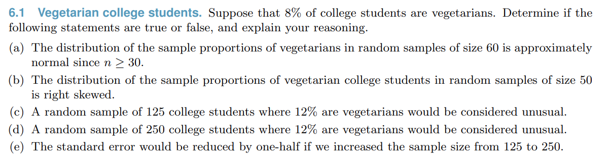
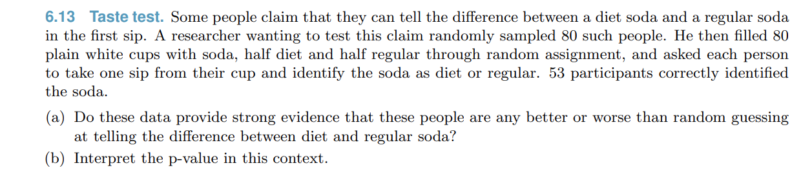

```{r setup, include=FALSE}
knitr::opts_chunk$set(echo = FALSE)
knitr::opts_chunk$set(warning = FALSE, message = FALSE) 
knitr::opts_chunk$set(comment = "")
```

## A recap

* The first section introduced basic probability, which then led into basic statistical inference
* We defined a sampling distribution, and distinguished it from the population distribution and a sample distribution
* We used the characteristics of the sampling distribution to compute confidence intervals, which give us a level of precision around statistical estimates

## Where we're headed

* We want to perform various types of hypothesis tests
    * Are financial markets efficient?
    * Does welfare reduce employment?
    * Do harsh criminal sentences reduce crime?
    * Do firms increase green energy investments in response to subsidies?
    * Do cats respond to cat music?
    
## Hypothesis Testing Roadmap

* Hypothesis testing for proportions (5.3, 6.1)
* Differences in proportions (6.2)
* Goodness of Fit (6.3)
* t-distribution (7.1,7.2)
* ANOVA (7.4)

## General theme with hypothesis testing

* Calculate the standard error
    * $\sqrt{\frac{\hat p (1-\hat p)}{n}}$
* Calculate a test statistic
    * $\frac{\hat p -p_0}{\sigma_{\hat p}}$
* Look up the value in a table
    * Here a normal table
* Depending on what we're testing, these all change a bit

## General theme with hypothesis testing

* Our base case is the null hypothesis, $H_0$
* we either reject $H_0$ (if $p<\alpha$) or fail to reject $H_0$
* we make a type I error if we incorrectly reject $H_0$, and a type II error if we incorrectly fail to reject $H_0$

## Confidence Interval Refresher

* We randomly survey 100 UIC students and find that 60 are female. Calculate a 95% confidence interval for the proportion of students who are female at UIC

```{r}
library(data.table)
library(ggplot2)
library(magrittr)
x0 <- c(.9,.95,.975,.99,.995)
y0 <- round(qnorm(x0),3)
dt <- data.table(p=x0,`x:p=F(x)`=y0)
dt
```

## Transitioning to Hypothesis Testing

* Is this result consistent with the hypothesis that half of UIC students being female?
* Calculate the probability that a sample of 100 students would contain at least 60 women given that the true proportion is 0.5.

## A basic Z Table

```{r}
x0 <- seq(from=-3, to=0, by=0.5)
x1 <- seq(from=0, to=3, by=0.5)
y0 <- round(pnorm(x0),2)
y1 <- round(pnorm(x1),2)
dt <- data.table(x=x0,`F(x)`=y0,`     `="     ",x=x1,`F(x)`=y1)
dt
```

## Two tailed

* Suppose that we don't know whether to expect more or less than half of students to be female. Calculate the probability that $|p - \hat p| > 0.1$ in a sample of 100 given $p=.5$


## Wald-test vs NHST

* Compare the answers to the confidence-interval approach and the two-tailed approach
* When we reject the null hypothesis, we're saying that the results are inconsistent with our hypothesis. The proportion of women is not exactly 0.5 (but it could be close to 0.5)
* When we fail to reject the null hypothesis, we're saying the results are consistent with our hypothesis. The range of reasonable values for $\hat p$ includes 0.5
    * If our confidence interval is wide, this may also be consistent with, say, $\hat p=0.7$ or even $\hat p=0.99$
    
## Conceptual Question

* You are testing whether a coin is fair. You fail to reject the null hypothesis with $\sigma_{\hat p}=0.001$. You conclude:

* A The coin is fair
* B The coin is not fair
* C The coin is very likely fair
* D The coin is either fair, or very close to fair
* E The coin is not fair, but the degree of bias is small

## General Hypothesis Steps for Proportions

* Write $H_0$ and $H_1$
* Calculate standard error $\sigma_{\hat p} = \sqrt{\frac{\hat p (1-\hat p)}{n}}$
    * This is the Wald approach. Can also calculate using $p_0$ instead of $\hat p$
* Calculate test statistic: $z=\frac{\hat p - p_0}{\sigma_{\hat p}}$
* Calculate p-value (2 tailed): $1-[\Phi(z)-\Phi(-z)]$
* Compare $p$ to $\alpha$
* Make conclusion

## Book Question



## Book Question



## A note on power

* The probability of of correctly rejecting a null hypothesis is called **power** (labeled $\beta$, the complement of the type II error rate)
* This differs by 'effect size' (the distance from our null hypothesis)
* If our null is that $p=.5$, it would be very easy to reject if $p=.99$, but very hard if $p=.501$

## Power Calculation

* Our null hypothesis is $p_0=0.5$. We sample with $n=100$ individuals. Calculate the probability that we reject the null hypothesis if the true proportion is $p=0.6$ (using a two-tailed test)

## Power Curve

* We can calculate the probability of rejecting the null when $p=0.55$, $p=0.6$ ,$p=0.99$, etc.
* We can graph all of these, yielding a **power curve**

## Power Curve (n=30)

```{r}
library(ggplot2)
library(scales)
library(data.table)
n <- 30
p <- seq(from=0.5,to=1,by=.01)
se <- sqrt(p*(1-p)/n)
se0 <- sqrt(.5*.5/n)
critu <- .5+1.96*se0
critl <- .5-1.96*se0
upper <- (critu-p)/se
lower <- (critl-p)/se
b <- pnorm(lower) + (1-pnorm(upper))
ggplot(data=data.table(p,power=b),aes(x=p,y=power)) + geom_line() + theme_bw() + scale_y_continuous(breaks=pretty_breaks(10),minor_breaks=pretty_breaks(20)) +
  ggtitle("Power Curve: p0=0.5, n=30") + theme(plot.title = element_text(hjust = 0.5))

```

## Power Curve (bigger sample)
```{r}
library(ggplot2)
library(scales)
library(data.table)
n <- 100
p <- seq(from=0.5,to=0.75,by=.01)
se <- sqrt(p*(1-p)/n)
se0 <- sqrt(.5*.5/n)
critu <- .5+1.96*se0
critl <- .5-1.96*se0
upper <- (critu-p)/se
lower <- (critl-p)/se
b <- pnorm(lower) + (1-pnorm(upper))
ggplot(data=data.table(p,power=b),aes(x=p,y=power)) + geom_line() + theme_bw() + scale_y_continuous(breaks=pretty_breaks(10),minor_breaks=pretty_breaks(20)) +
  ggtitle("Power Curve: p0=0.5, n=100") + theme(plot.title = element_text(hjust = 0.5))

```

## Power Curve: bigger sample

```{r}
library(ggplot2)
library(scales)
library(data.table)
n <- 1000
p <- seq(from=0.5,to=0.6,by=.005)
se <- sqrt(p*(1-p)/n)
se0 <- sqrt(.5*.5/n)
critu <- .5+1.96*se0
critl <- .5-1.96*se0
upper <- (critu-p)/se
lower <- (critl-p)/se
b <- pnorm(lower) + (1-pnorm(upper))
ggplot(data=data.table(p,power=b),aes(x=p,y=power)) + geom_line() + theme_bw() + scale_y_continuous(breaks=pretty_breaks(10),minor_breaks=pretty_breaks(20)) +
  ggtitle("Power Curve: p0=0.5, n=1000") + theme(plot.title = element_text(hjust = 0.5))

```

## Power Curve: Diaconis

```{r}
library(ggplot2)
library(scales)
library(data.table)
n <- 100000
p <- seq(from=0.5,to=0.51,by=.001)
se <- sqrt(p*(1-p)/n)
se0 <- sqrt(.5*.5/n)
critu <- .5+1.96*se0
critl <- .5-1.96*se0
upper <- (critu-p)/se
lower <- (critl-p)/se
b <- pnorm(lower) + (1-pnorm(upper))
ggplot(data=data.table(p,power=b),aes(x=p,y=power)) + geom_line() + theme_bw() + scale_y_continuous(breaks=pretty_breaks(10),minor_breaks=pretty_breaks(20)) +
  ggtitle("Power Curve: p0=0.5, n=100,000") + theme(plot.title = element_text(hjust = 0.5))

```

## Calculating Sample Size

* When designing experiments, we sometimes get to choose the sample size. Larger samples are more expensive, so we want to use the smallest sample that will still give us power to achieve the results we want.

## Calculating Sample Size

* You're studying the effect of obtaining a bachelor's degree on future earnings. You want to be able to detect at least a 1\% effect size, which in this case is \$400. Earnings have a mean of \$40,000 with a standard deviation of \$10,000. Calculate the minimum sample size you need to be able to detect this effect with at least 95\% power. Assume the standard error is identical for both distributions.

## Sample Size Diagram

```{r, out.width="100%"}
x=seq(from=-400,to=400,by=5)
y=dnorm(x,sd=110)
dtnull <- data.table(x,y,distribution="null")
x=seq(from=000,to=800,by=5)
y=dnorm(x,mean=400,sd=110)
dtthresh  <- data.table(x=x,y=y,distribution="1% effect")
dtcomb <- rbind(dtnull,dtthresh)
ggplot(data=dtcomb,aes(x=x,y=y,group=distribution,color=distribution)) + geom_line() + theme_bw() + geom_ribbon(data=dtnull[x>215],aes(x=x,ymax=y), ymin=0,fill=rgb(1,0,0,.75)) + geom_label(aes(x=215,y=-.0001,label="z*")) +
  scale_x_continuous(breaks=pretty_breaks(10),minor_breaks=pretty_breaks(20)) + 
  geom_ribbon(data=dtthresh[x>215],aes(x=x,ymax=y), ymin=0,fill=rgb(0,0,1,.25)) +
  ggtitle("Null vs Minimum Effect Size Distribution") + theme(plot.title = element_text(hjust = 0.5)) +
  guides(fill = "none")
```

## Brief summary on power

* Similar to type I and type II errors, we can summarize conclusions with respect to power:
* Reject $H_0$ with low power: large but imprecise effect
* Reject $H_0$ with high power: precise effect, may not be of practical significance
* Fail to reject $H_0$ with low power: imprecise null. Very little can be concluded.
* Fail to reject $H_0$ with high power: precise null. We can rule out even modest effects.

## Differences in Proportions

* Suppose we want to make a comparison across populations involving a proportion. Say we're comparing the proportion correct of multiple choice answers for male and female students.
* We want to test the null hypothesis that $p_1=p_2$
* How would we go about this?

## Differences in Proportions

* Before, $\hat p \sim N(p,\sigma_\hat p)$ - the sampling distribution was approximately normal by the central limit theorem with standard deviation equal to the standard error
* Now we need the distribution of $\hat p_1-\hat p_2$, which we compare against 0
* How do we find the distribution of $\hat p_1 - \hat p_2$?

## Differences in Proportions: Standard Errors

* $\hat p_1 \sim N(p_1,\sigma_{\hat p_1})$, $\hat p_2 \sim N(p_2,\sigma_{\hat p_2})$
* A linear combination of normal random variables is normal
* $var(X-Y)=var(X)+var(Y)$ for independent random variables
* $\hat p_1 - \hat p_2 \sim N(p_1-p_2, \sqrt{\sigma^2_{\hat p_1}+\sigma^2_{\hat p_2}})$

## Difference in Proportion: Standard Errors

* Directly substituting in values, the difference in proportions is normal with mean $\hat p_1-\hat p_2$ and standard error equal to:
* $SE = \sqrt{\frac{\hat p_1(1-\hat p_1)}{n_1} + \frac{\hat p_2(1-\hat p_2)}{n_2}}$
    * It's just two copies of our formula glued together
    
## Difference in Proportions: Example

* Your class has 30 female and 20 male students. Female students correctly answered 80\% of the multiple choice questions, while male students correctly answered 70\%. Do you have evidence to suggest that male and female students are different? Use $\alpha=.05$

## Example

* Marketing has presented you with two advertisements and want you to choose between them. You run a pilot where you show the advertisements to a test group and see what percentage react favorably. A group of 100 individuals are shown each advertisement. 40 percent of participants respond favorably for advertisement 1 compared to 55 percent for advertisement 2. Calculate a 95\% confidence interval for the difference in favorability of the advertisements.

## General one-sample means

* When testing single proportions, we used the point value of $\hat p$ and calculated the standard error as $\sqrt{\frac{\hat p(1-\hat p)}{n}}$. 
* In general, we can calculate our point estimate as $\bar x$ and calculate a standard error as $\frac{s}{\sqrt n}$
* If our sample size is large, everything else remains identical

## Example

* Your average teaching evaluation is 4.474 with a standard deviation of 0.080. You want to know the typical range of evaluations you might receive the following semester. Calculate a 95\% confidence interval.
* What assumptions are required for this to be a reasonable method?

## The t-distribution

* If x is a normal random variable, then $\frac{x-\mu}{\sigma \sqrt n}$ is also normally distributed
* But if we don't know $\sigma$, then we instead estimate $s$ from the data - it's a random variable
* It turns out that $\frac{x-\bar x}{s \sqrt n}$ is only *asymptotically* normal
    * s follows a chi-square distribution (we'll cover later)
    * This transformation yields something called a t-distribution

## The t-distribution

* When we estimate s from the data, our standardized value $\frac{\bar x - \mu_0}{s\sqrt n}\sim t(\nu=n-1)$
    * This is a t-distribution with $\nu=n-1$ *degrees of freedom*
    * We look up the values in a t-table. There is a separate table for each degree of freedom

## T distribution Graph

```{r}
library(data.table)
library(ggplot2)
x <- seq(from=-3,to=3,by=.01)
dt <- data.table(x=x,df=rep(c(1,5,10,30,100,10000),each=length(x)))
dt[,y := stats::dt(x,df)]
dt[,df := as.factor(df)]
ggplot(data=dt,aes(x=x,y=y,group=df,color=df)) + geom_line() + theme_bw()
```

## Basic T-table

```{r}
library(data.table)
library(ggplot2)
library(magrittr)
x0 <- c(.9,.95,.975,.99,.995)
y0 <- round(qnorm(x0),3)
y1 <- round(qt(x0,5),3)
y2 <- round(qt(x0,10),3)
y3 <- round(qt(x0,15),3)
y4 <- round(qt(x0,20),3)
y5 <- round(qt(x0,25),3)
y6 <- round(qt(x0,30),3)
dt <- data.table(p=x0,`df=5`=y2,`df=10`=y3,`df=30`=y6,`z`=y0)
dt
```

## When we use a t-distribution

* As $n\to\infty$, the t-distribution approaches a normal distribution. If our sample size is above around 100 we can just use a normal distribution
* For smaller values of n, we use a t-distribution instead. In addition to independent, identically distributed samples, we also **require that the underlying distribution is normally distributed**
* In practice we'll use the t-distribution for small samples even if this is violated since it's still a better estimate than the normal distribution

## Differences in Means

* The most common application for a t-test is assessing whether the mean of two groups is different
* To calculate the standard error, we use the same trick as before:
* $\sigma_{x_1-x_2} = \sqrt{\frac{s_1^2}{n_1}+\frac{s_2^2}{n_2}}$
* degrees of freedom is $n_1+n_2-2$ if the variances of the two groups are equal
    * If not you need software to calculate. Just use $n_1+n_2-2$

## Example

* You randomly assign patients to either receive blood pressure medication or a placebo with each group having 11 individuals. The placebo group ends up with a mean systolic blood pressure of 135 mm Hg with standard deviation of 8, while the treatment group has a mean blood pressure of 130 mm Hg with a standard deviation of 10. Can we conclude that the medication reduces blood pressure?

## Paired t-test

* You assign 11 individuals to a blood pressure medication, and measure their blood pressure before and after treatment. Before treatment they had mean 135 with standard deviation 8. Afterwards they had mean 125 with standard deviation 10. The difference between the two has mean -10 with standard deviation of 4. Was there a statistically significant drop in blood pressure?

## Some accounting

In the previous example, the before group had sd of 8, the after group had sd of 10, and the difference had sd of 4. How?

* A This is a flawed example - the numbers don't match reality
* B Before and After are negatively correlated. This implies treatment effects depend on initial blood pressure level
* C Before and After are positively correlated. Since the individual is the same, relative results will tend to be close together.
* D We're using within-individual variation instead of across-individual variation, which is generally much smaller

## Cross-sectional vs paired differences

* A paired t-test only uses within-individual variation, which is often much lower than across-individual variation. As a result, standard errors are usually lower
* We have the same number of observations, but we also have additional information *linking* the two datasets. This additional information gives us more precision in our estimate

## Chi-Square

* So far we've tested for differences in means among two groups
* While this is powerful, occasionally we'll have many different groups that we want to compare
* One common way this arises is testing if data comes from a specific distribution

## Motivating Example

* You buy a bag of Laffy Taffy Fruit Combos. It contains four flavor combinations: Strawberry-Kiwi, Mango-Passionfruit, Wildberry-Banana, and Strawberry-Orange
* You want to know if the the flavor combinations are uniformly distributed
* In a package of 16, you obtain 7, 2, 3, and 4 of the flavors above, respectively
* How can we go about answering this question?

## Combining Results

* If we were just testing if strawberry-kiwi were different from 25\%, we would calculate the standardized value of the difference: $z_1=\frac{\frac{7}{16}-\frac{4}{16}}{SE}$
* We can calculate the same for each of the three other categories to get $z_2, z_3$, and $z_4$
* We then combine them in a smart way: $z_1^2 + z_2^2 + z_3^2 + z_4^2$

## Introducing the Chi-Square Distribution

* Our null hypothesis is that 25\% of the candy falls in each category. On average we'd expect 4 of each
* We can  calculate the deviance from this distribution: the sum of the squared differences between expected and observed results
* If we assume that individual deviations are normally distributed, then our total deviance is the sum of 4 squared normal distributions: $\chi^2 = \sum_{i=1}^4 Z_i^2$
* This is a chi-square distribution with 3 degrees of freedom

## Chi-Square Test Statistic

* Our standard errors need to be modified slightly when dealing with multiple comparisons. The actual test statistic ends up as the following:
* $\chi^2 = \sum_{i=1}^k \frac{(Observed_i-Expected_i)^2}{Expected_i}$a
* This follows a $\chi^2$ distribution with $k-1$ degrees of freedom

## Looking up a p-value with chi-square

* Good news: the chi-square distribution only takes on non-negative values (why?)
* There's only ever 1 tail in the test
* For a p-value, always take $1-F(\chi^2)$ where $F(\chi^2)$ is the corresponding value in the table

## Basic chi-square table

```{r}
library(data.table)
library(ggplot2)
library(magrittr)
x0 <- c(.9,.95,.975,.99,.995)
y1 <- round(qchisq(x0,2),3)
y2 <- round(qchisq(x0,3),3)
y3 <- round(qchisq(x0,4),3)
y4 <- round(qchisq(x0,5),3)
y5 <- round(qchisq(x0,11),3)
y6 <- round(qchisq(x0,30),3)
dt <- data.table(p=x0,`df=2`=y1,`df=3`=y2,`df=4`=y3,`df=5`=y4)
dt
```

## Example: distribution

* Students walk by a classroom at a rate of 2 students/minute. You want to test whether this follows a Poisson process. A poisson random variable has the following pmf (with number of students in each of 60 1 minute intervals labeled as N) :

## Example: distribution

```{r}
set.seed(1)
x <- 0:5
n <- rpois(60,2)
y <- c(dpois(0:4,2),1-sum(dpois(0:4,2)))
dt <- data.table(x,p=round(y,2))
dt2 <- as.data.table(n)[,.N,keyby=pmin(n,5)][,.(x=pmin,N)]
dt <- merge(dt,dt2,by="x",all.x=TRUE)
dt[is.na(N),N:=0]
dt[,x:=as.character(x)]
dt[x=="5",x:="5+"]
dt
```

## Testing Independence

* Suppose we're interested in knowing whether there's a relationship between pet ownership and major. You are given the following contingency table. How can we test for independence?

```{r}
math <- c(10,10,0,20)
econ <- c(5,12,3,20)
art <- c(15,5,0,20)
total <- c(30,27,3,60)
dt <- data.frame(math,econ,art,total)
rownames(dt) <- c("dog","cat","bunny","total")
dt
```

## The F-test (ANOVA)

* Chi-square can be thought of as the multivariate version of a difference-in-proportions test
* We can do the same analog for a differences-in-means test among many variables
* Our null hypothesis will be that $\mu_1=\mu_2=...=\mu_n$

## F-test intuition

* If our groups are identical, then our within-group variance and our across-group variance will differ only by sample size
    * $\frac{MSG}{MSE}=1$
* Calculate the ratio of within- to across- variance
    * A higher across-group variance implies differences between groups'
* The ratio of normal distributions is an F-distribution - look up in a table
    
## F-test statistic

* $F=\frac{MSG}{MSE}$
* $MSG=\frac{1}{k-1}\sum_{i=1}^k n_i (\bar x_i - \bar x)^2$
* $MSE= \frac{1}{n-k}[(n_1-1)s_1^2 + (n_2-1)s_2^2+...+(n_k-1)s_k^2]$
* Ew. We just let software calculate this for us

## The F-distribution

* The F-distribution has 2 degrees of freedom (yay)
* The numerator degrees of freedom is $k-1$, where k is the number of groups
* The denominator degrees of freedom is $n-k$, where n is the sample size

## F-test assumptions

* iid sample, as always
* The f distribution is the ratio of two normal distributions. Thus, we require normality
* Homoskedasticity (constant variance). We're testing for differences by using a variance decomposition. Thus we need variance to be constant across groups (even if means aren't!)

## Example

```{r}
set.seed(1)
x <- rep(c('econ','math','art'),each=20)
y <- c(rnorm(20,75,sd=15),rnorm(20,80,sd=15),rnorm(20,70,sd=15))
dt <- data.table(x,y)
ggplot(data=dt,aes(x=x,y=y)) + geom_boxplot() + theme_bw()
```

## Example

```{r}
dtx <- dt[,.(mean_score=round(mean(y),1),variance=round(var(y),1),n=20),keyby=.(major=x)]
dtt <- data.table(major="total",mean_score=dt[,round(mean(y),1)],variance=round(var(dt$y),1),n=60)
rbind(dtx,dtt)

```

## Example

```{r}
summary(aov(data=dt, y ~ x))
#dt[,mean(y),keyby=x][,sum((V1-mean(V1))^2)]*20
#dt[,var(y),keyby=x][,sum(V1)*19]
```

## Candy!

```{r}
xx <- t(matrix(c(7,4,7,18,2,6,6,14,3,2,4,9,4,5,1,10,16,17,18,51),c(4,5)))
rownames(xx) <- c("SK","MP","WB","SO","Tot")
colnames(xx) <- c("Bag1","Bag2","Bag3","Tot")
xx
```